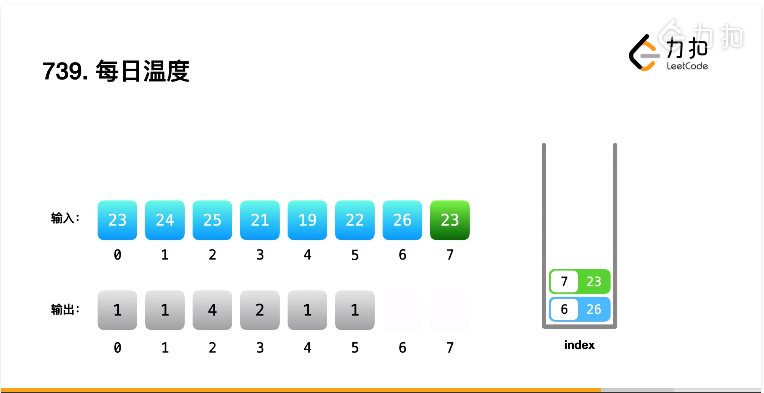

## 栈
括号问题在面试中出现频率非常高， 这类题目我们一般首选用栈来做。

为什么可以用栈做？大家想想，括号成立意味着什么？意味着对称性。

巧了，根据栈的后进先出原则，一组数据的入栈和出栈顺序刚好是对称的。比如说1、2、3、4、5、6按顺序入栈，其对应的出栈序列就是 6、5、4、3、2、1：
```
123456
654321

"()"
")("
```

对称关系一目了然。

因此这里大家可以记下一个规律：题目中**若涉及括号问题，则很有可能和栈相关**。

### 739-每日温度

1. 一个数组里面或者一个集合结构里面需要查找递增/递减/递进式关系时候需要用到栈结构
2. 比如排序算法中的插入排序很像，但因为插入排序需要移动位置而不适用




